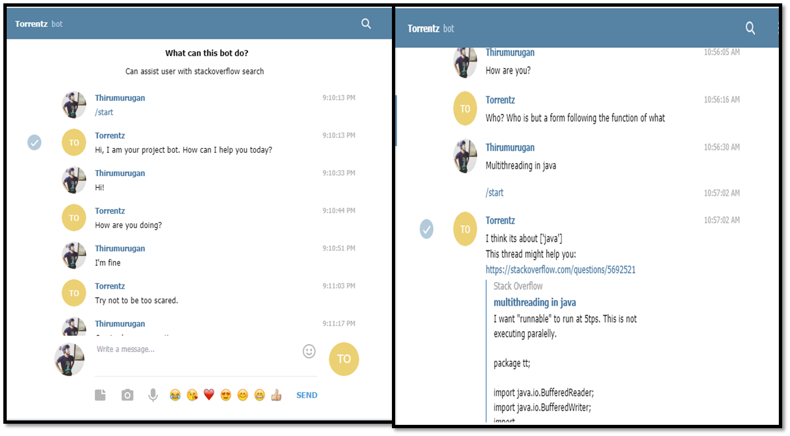
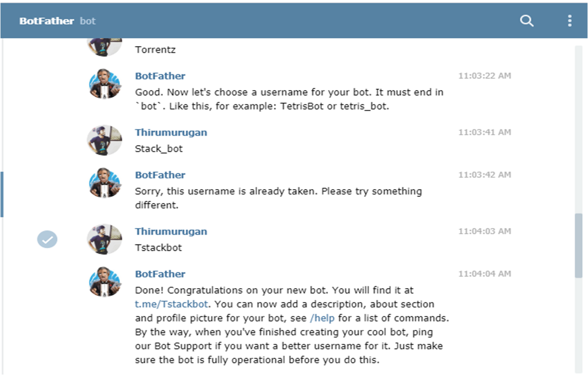

# Tstackbot-torrentz
#### Thirumurugan Ramar
             

Made a dialogue chatbot which would be able to answer programming-related questions (using StackOverflow dataset); chit-chat and simulate dialogue on all non programming-related questions.

For both Intent recognizer and Tag classifier  used LogisicRegression on HashingVectorizer features. For most similar thread retrieval I pretrained StarSpace embeddings and used unweighted sum over words embeddings for text summarization. Most similar thread taken by least cosine distance between summarized texts.

# Screenshots:

#### From masterbot telegram

# Requirements:

-> AWS account to host the chatbot (Free-tier instance)

-> Telegram Account,(Created a bot using botfather and modified its API)

-> Docker-to generate star space embeddings  (Ubuntu version)

-> Putty SSH  (With the authorised PEM file,generated through AWS instance

-> WinSCP - to transfer files from local machine to AWS instance

-> Notebooks can be run either through Google colab or jupyter notebook.

# Files to run the project:

### Starspace_embeddings_Stackoverflow.ipynb :

my_starspace_embeddings_0612.tsv-- the starspace embeddings using the specific dataset for our specific task i.e. stackoverflow post.

### utils.py:
contains necessary helper functions

### dialogue_manager.py:
contains the exact flow of how chatbot interacts with the user

### main_bot.py:
is the python file you run on AWS with input as telegram token generated for our bot(on telegram)

### Tstackbot.ipynb:
intent_recognizer.pkl-- intent recognition model;

tag_classifier.pkl-- programming language classification model;

tfidf_vectorizer.pkl-- vectorizer used during training;

thread_embeddings_by_tags-- folder with thread embeddings, arranged by tags.(Folder containing embeddings of stackoverflow posts/threads segregated “tag” wise. This saves lot of time at runtime in generating the embeddings needed to compare various stackoverflow threads and rank them as per the closest similarity to our question)

# Acknowledgement:
This chatbot was made with the help of the resources provided by the NLP course in coursera by  National Research University Higher School of Economics

